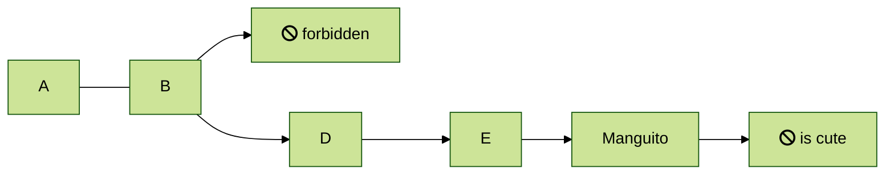
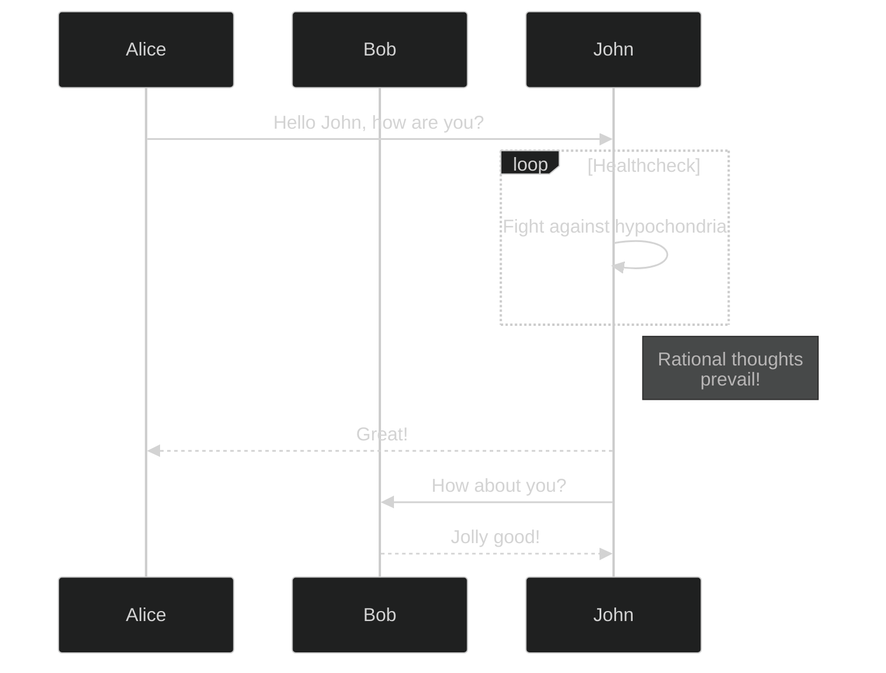

# Guide

## Guide subtitle

> Mermaid Example

Lorem ipsum dolor sit amet consectetur adipisicing elit. Placeat officia ratione perferendis quis, fuga laudantium ipsa eligendi adipisci debitis corrupti explicabo distinctio a obcaecati iste. Nam, dolore vero saepe temporibus soluta atque deleniti nulla repellendus autem placeat corrupti assumenda qui laborum, voluptates esse unde. Cupiditate quasi facilis magnam iure dolorum doloremque repellendus sint eos, necessitatibus natus mollitia in sapiente quam magni ab. Veritatis optio recusandae consequatur explicabo, unde consequuntur asperiores quo velit qui, assumenda nostrum! Amet ipsum explicabo ut similique sed. Quia asperiores porro, repudiandae in consectetur accusamus. Perferendis nisi nulla deserunt maxime. Eum tempora veniam minus voluptatem aut consequatur!

